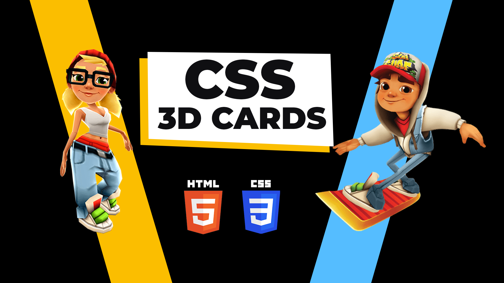

# CSS 3D Card Hover Effect | Subway Surfers 3D Cards

The CSS 3D Card Hover Effect, inspired by Subway Surfers' 3D cards, introduces an interactive and visually engaging element to web design. Triggered by user hover actions, this effect employs CSS transformations to bring a sense of depth and movement to card elements. With features like rotations, smooth transitions, and subtle shadow effects, it creates an immersive and dynamic experience. Applied to product cards or portfolio items, it enhances user engagement and adds a touch of sophistication to the overall design, making it both visually appealing and interactive.

Youtube Tutorial Link: https://youtu.be/q7rZPnsW0ew

